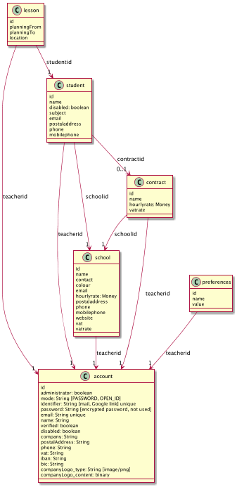

= Migration

The H2 database of a version 1.x of iTeach can be migrated to the new
<<model.adoc,Neo4J format>> by following those instructions.

== Importing the H2 database

Download the H2 `data.h2.db` database file, typically found at
`/opt/iteach/db/data.h2.db` if you have followed the installation
instructions for 1.x.

NOTE: This file is a H2 database file format for http://h2database.com/[H2]
version 1.3 and should be opened with version 1.3.

Keep this file in a safe place since it will be used as input for the migration.

== Opening the H2 database file

Before proceeding to the migration, you can open the H2 file using the
http://h2database.com/html/tutorial.html#tutorial_starting_h2_console[H2 Console].

1. Download the http://h2database.com/html/download.html[H2 runtime], version 1.3.x,
   and expand it in a directory designed by `${H2}`.
2. Run the following command to open the `data.h2.db` file in the H2 console:

[source,bash]
----
$H2/bin/h2.sh
----

3. In the H2 console, enter the path to the `data.h2.db` file but *omit* the
`.h2.db` suffix
4. Use the correct credentials, typically `iteach` and `iteach`

== iTeach 1.x model

=== Evolutions for 2.x

* Student always attached to a contract between a school and a teacher
* A student can be attached to several contracts (when working with several teachers)
* `account` table transformed into `teacher` - authentication to be dealt with otherwise

=== Deprecation

* `token` table not used any longer
* `version` table not used any longer
* `invoice` table not used any longer

== Migrating to Neo4J
